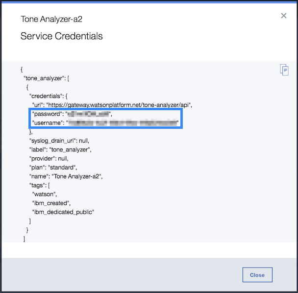
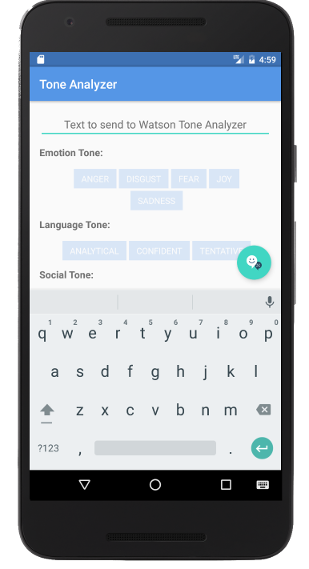
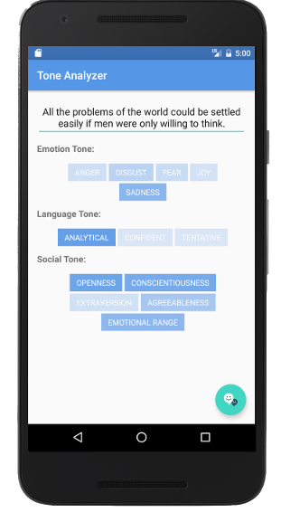

## Tone Analyzer
Bluemix Mobile Starter for Tone Analyzer in Java

[](https://bluemix.net)
[](https://developer.android.com/index.html)

### Table of Contents
* [Summary](#summary)
* [Requirements](#requirements)
* [Configuration](#configuration)
* [Run](#run)
* [License](#license)

### Summary
The Bluemix Mobile Starter for Watson Tone Analyzer showcases the Tone Analyzer service from Watson and gives you integration points for each of the Bluemix Mobile services.

### Requirements
* A [Bluemix](http://bluemix.net) Account
* [Android Studio](https://developer.android.com/studio/index.html)
* A [Tone Analyzer](https://console.ng.bluemix.net/catalog/services/tone-analyzer/) service instance obtained from the [Bluemix Catalog](https://console.ng.bluemix.net/catalog/)

### Configuration
* Open the project in Android Studio and perform a Gradle Sync.
* Navigate to `res/values/watson_credentials.xml` and input your Tone Analyzer Password and Username.

```HTML
<resources>
    <string name="watson_tone_analyzer_password">xxxxxxxxxxxx</string>
    <string name="watson_tone_analyzer_username">xxxxxxxx-xxxx-xxxx-xxxx-xxxxxxxxxxxx</string>
</resources>
```

To obtain your API Key, navigate to your `Service Credentials` tab in your Tone Analyzer Service Dashboard:




### Run
* You can now build and run the application from Android Studio!

 

The application allows you to use the Watson Tone Analyzer service to analyze text. Tone Analyzer leverages cognitive linguistic analysis to identify a variety of tones at both the sentence and document level. This insight can then used to refine and improve communications. 

Enter text in the input text box and then click the Tone Analyzer button to see the results. The results will be shown under each category after the text has been analyzed. The tag visability will change based on the percentage returned from Watson, but you can click on tag directly to see the exact percentage.

### License
This package contains code licensed under the Apache License, Version 2.0 (the "License"). You may obtain a copy of the License at http://www.apache.org/licenses/LICENSE-2.0 and may also view the License in the LICENSE file within this package.
